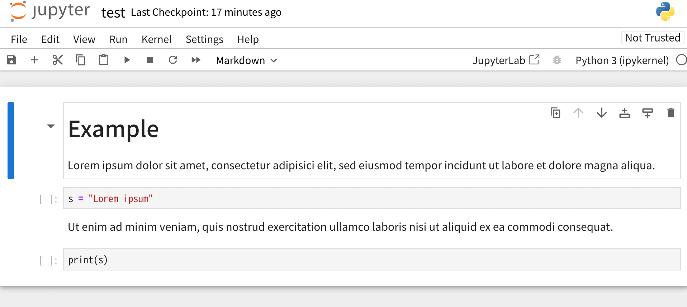

Here is a command line tool that converts a Markdown file into a Jupyter notebook file.

### Example

##### Input

````markdown
# Example

Lorem ipsum dolor sit amet, consectetur adipisici elit, sed eiusmod tempor incidunt ut labore et dolore magna aliqua.

```python
s = "Lorem ipsum"
```

Ut enim ad minim veniam, quis nostrud exercitation ullamco laboris nisi ut aliquid ex ea commodi consequat.

```python
print(s)
```
````

##### Result (Opened with [Jupyter Notebook](https://github.com/jupyter/notebook))



### Requirements

+ Python 3.3 or later

### Usage

```sh
$ python md2ipynb.py FILE.md
```

To create a code cell, use ``` in the input file to form a block. You should also provide the language identifier. (e.g. `python` for Python. See [this documentation](https://docs.github.com/en/get-started/writing-on-github/working-with-advanced-formatting/creating-and-highlighting-code-blocks) for more information.) For example:

````markdown
```python
import os
```
````

A code cell will only be created if the programming language of the block matches the language to be used in the notebook. The language can be set with `--language`, while the identifier to search for can be set with `--language-identifier`.
The block has to be at the top (unindented) level.

This does not check the syntax however, so it also turns things like

````markdown 
```python
%pip install numpy
```
````

into code cells (even if it isn't correct Python), as long as the identifier matches.

Everything else (including a code block of a different programming language) in the input file will be placed into Markdown cells. When creating a Markdown cell, the leading blank lines (that contain only line breaks) will be removed. If a Markdown cell would contain only blank lines, it is not created. This prevents creating a large number of empty cells.

### References

* https://nbformat.readthedocs.io/en/latest/format_description.html

* https://ecma-international.org/wp-content/uploads/ECMA-404_2nd_edition_december_2017.pdf

* https://docs.github.com/en/get-started/writing-on-github/working-with-advanced-formatting/creating-and-highlighting-code-blocks

* https://daringfireball.net/projects/markdown/syntax

* https://docs.python.org/3/library/re.html
